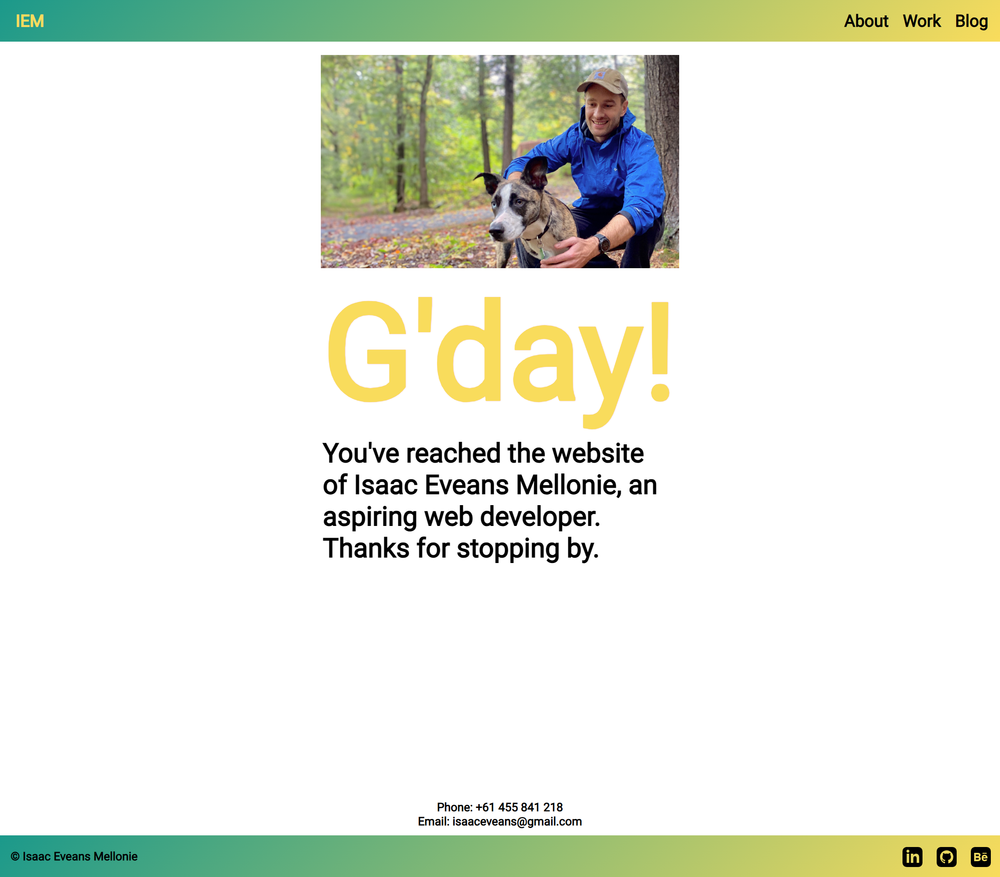

# T1A2 Portfolio Assignment

## Author: Isaac Eveans Mellonie

### [Website](https://www.isaacmellonie.com)

### [Github Repo](https://github.com/IsaacMellonie/T1A2-Portfolio-Website)

### [Presentation](https://youtu.be/TVxV7EIvqnM)

## Purpose of Website

The purpose of this website is to showcase my evoloving skills and creative journey in the world of web development. A website to demonstrate my technical proficiency and highlight my growth as a developer. This portfolio aims to provide a clear visual representation of my work, enabling potential employers, peers, and educators to assess my abilitites and potential. 

## Functionality/Features

This is a dynamicly responsive website designed to display on different sized devices. It implements flexbox and media queries to achieve this. There are four HTML documents, Index, About, Work, and Blog and one CSS document for each. 

I aimed to provide a clear visual representation of my work through colour and minimal design while utilising semantic HTML to provide easier access for other developers.

In terms of navigation, the site consistently displays a navigation bar at the header with nav links to the other pages and a footer with links to Github, LinkedIn and Behance that showcase my work history and skills.

Using a simple white background colour allows the main content to be the focus of each page. Each element is styled to create balance of text to image. 

- Home: This is the first page seen when opening the site. It's a welcome to the site with a brief intro to myself and the design of the site. Interactivity is minimal apart from a hover feature for the welcome message. I leaned toward a neutral palette of blue, green amd yellow to represent my love of nature. This is again displayed with the main image.

- About: Summarises my journey with Coder Academy. It gives more information about my work, hobbies and aspects of my life that have shaped where I am today.

- Work: There are three main sections on this page: work, study and links. They briefly display work and study history as well as buttons with links to Github, LinkedIn, Behance and my resume. Interactivity is added with Hover colour transitions on the button links.

- Blog: This page is a favourite of mine. It showcases my ability to create a simple design that allows the content to be the focal point. Each blog article contains a date, heading, image, and body text. The image takes up a large portion of the avaible page width.

## Sitemap

- The header is on every page and contains navigation for the site pages. There's 'IEM' in the top left which will bring you home (index.html).
## Wireframes
Home\

About\

Work\

Blog\

## Screenshots

### Home Page

#### Phone
.png)
#### Tablet
.png)
#### Desktop

### About
#### Phone
.png)
#### Tablet
.png)
#### Desktop

### Work
#### Phone
.png)
#### Tablet
.png)
#### Desktop

### Blog
#### Phone
.png)
#### Tablet
.png)
#### Desktop

## Target Audience

My primary target audience encompasses potential employers, recruiters and other developers. It's important that my technical skills, creativity, and problem-solving capabilities are displayed for evaluation. I aim to display my proficiency in front end development and also display my project accomplishments. It's important to create a portfolio that leaves a lasting impression, showcasing my passion for web development and postioning me as a promising asset to any tech team or organisation.

## Tech Stack

- Semantic HTML and CSS: [VS Code](https://isaac-eveans-mellonie-t1a2.vercel.app/)
- Sitemap: [Adobe Illustrator](https://www.adobe.com/au/products/illustrator.html)
- Wireframes: [Figma](https://www.figma.com)
- Images (JPG, GIF, PNG): [Adobe Photoshop](https://www.adobe.com/au/products/photoshop.html)
- Resume: [Adobe InDesign](https://www.adobe.com/au/products/indesign.html)
- Slide Presentation: [Google Slides](https://www.google.com.au/slides/about/)
- Site Deployment: [Vercel](https://www.vercel.com)
